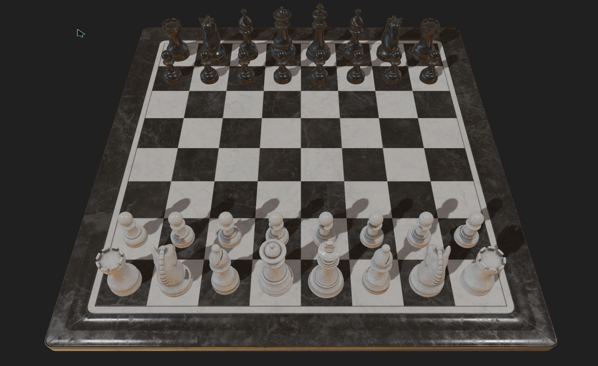
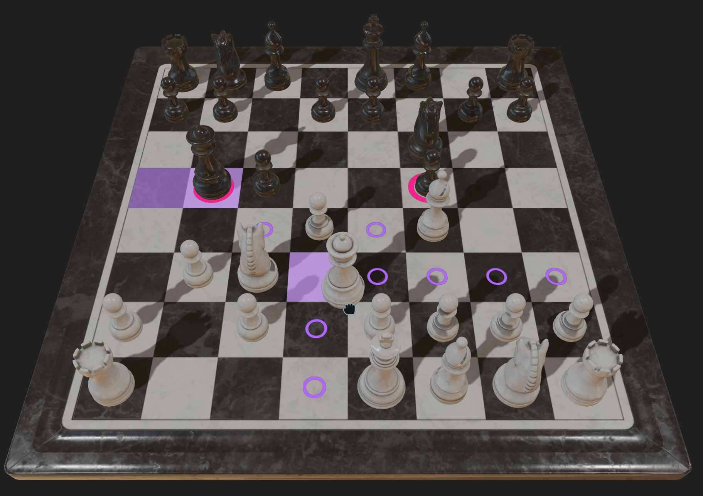

# Chess

3D version of classic game chess. Built with custom OpenGL engine.

## Screenshots




## Instructions

Pieces are moved using a drag-and-drop system. To start dragging a piece, use the left mouse button or A button (Xbox controller). When releasing the button, if the piece is over a valid square, it will move there; otherwise, it will return to its original position. Dragging can be canceled by pressing the right mouse button or B button (Xbox controller).

Press Escape to pause the game and access the settings menu.

The player using the keyboard and mouse moves the white pieces.  
If a controller is connected, it controls Player 2 (black pieces). Player 2 can only move pieces; they cannot pause or change settings.  
If no controller is connected, the mouse is used to move both players’ pieces.

### Shortcuts

- **F11** — Toggle fullscreen
- **Alt + F4** — Close the game

## Features

- Physically Based Rendering
- HDR rendering
- Shadow mapping
- Game hot code reloading

## Build

You need Microsoft C/C++ Build Tools. Make sure the MSVC compiler is accessible from the command line. You can verify by running:
```
cl
```

- **Debug build**: run `build_debug.bat`
- **Release build**: run `build_release.bat`

The game expects the following folders:
- bin: place the .exe and required .dll files here
- data: contains all asset folders (models, textures, audio, etc.)

### Credits

- [Casey Muratori](https://handmadehero.org/) — Creator of Handmade Hero, inspiration for custom game engine architecture
- [Joey de Vries](https://github.com/joeyDeVries) — Author of LearnOpenGL.com tutorials
- [Sean Barrett](https://github.com/nothings) — Author of the stb_image library
- [Riley Queen](https://polyhaven.com/all?a=Riley%20Queen) — Creator of the Chess Set model (via Poly Haven, CC0)
- [Disservin](https://github.com/Disservin) — Author of the chess-library
- [The FreeType Project](https://freetype.org/index.html) — FreeType font rendering library
- [David Reid](https://github.com/mackron) — Author of the miniaudio library
- [Johannes Kuhlmann](https://github.com/jkuhlmann) — Author of the cgltf library

### References

- [Handmade Hero — Casey Muratori](https://handmadehero.org/) Video series on building a complete game engine from scratch
- [LearnOpenGL — Joey de Vries](https://learnopengl.com)
- [Anton Gerdelan — Mouse Picking with Ray Casting](https://antongerdelan.net/opengl/raycasting.html)  
  A clear explanation of ray casting techniques for mouse picking in OpenGL.
- [Epic Games — Physically Based Shading Notes (Brian Karis, 2013)](https://blog.selfshadow.com/publications/s2013-shading-course/karis/s2013_pbs_epic_notes_v2.pdf)  
  Foundational reference for PBR workflows and theory used in real-time rendering.
- [OpenGL Programming/Modern OpenGL Tutorial Text Rendering 02](https://en.wikibooks.org/wiki/OpenGL_Programming/Modern_OpenGL_Tutorial_Text_Rendering_02)